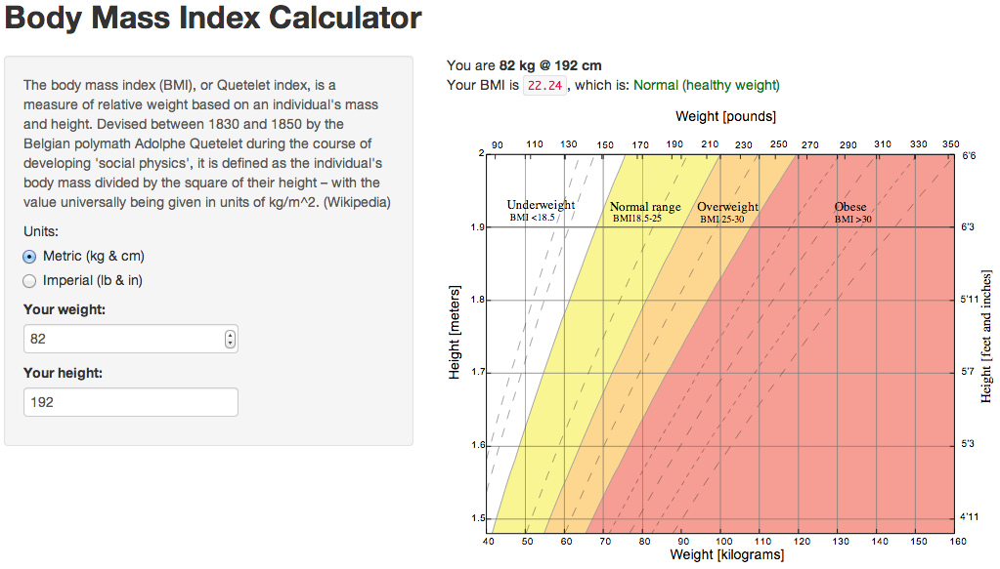

## About the app

The *BMI Calculator* is just a simple example of a Shiny app devised for the `Developing Data Products` course on Coursera. The source is [hosted on GitHub](https://github.com/aseifert/shiny-bmi), so feel free to fork it.

The usable program itself is [hosted on shinyapps.io](https://aseifert.shinyapps.io/BMI-Calculator/).
runA
The BMI calculation is really trivial, the only thing to note is that you have to multiply the index by 703 if you are dealing with imperial units:

```{r}
bmi <- function(mass, height, units) {
        bmi = mass / height^2
        
        if (units == IMPERIAL) {
                bmi = bmi * 703
        }
        
        return (bmi)
}
```

---

## The Body Mass Index

### What's a BMI?

"The body mass index (BMI), or Quetelet index, is a measure of relative weight based on an individual's mass and height.

Devised between 1830 and 1850 by the Belgian polymath Adolphe Quetelet during the course of developing 'social physics', it is defined as the individual's body mass divided by the square of their height – with the value universally being given in units of $kg/m2$." [1]

### Why should I care about my BMI?

"The BMI is used in a wide variety of contexts as a simple method to assess how much an individual's body weight departs from what is normal or desirable for a person of his or her height." [1]

[1] <small>[Body mass index on Wikipedia](https://en.wikipedia.org/wiki/Body_mass_index)</small>


---

## How to use the app

1. [Visit the app on shinyapps.io](https://aseifert.shinyapps.io/BMI-Calculator/)
2. Choose your preferred system of units, either metric (kilograms & centimetres) or imperial (pounds and inches).
3. Provide your weight
4. Provide your height
5. You will see the numbers on the right side update as you input your data. The chart gives you a good idea of how your BMI is to be interpreted.


---

## What the app looks like (Screenshot)




